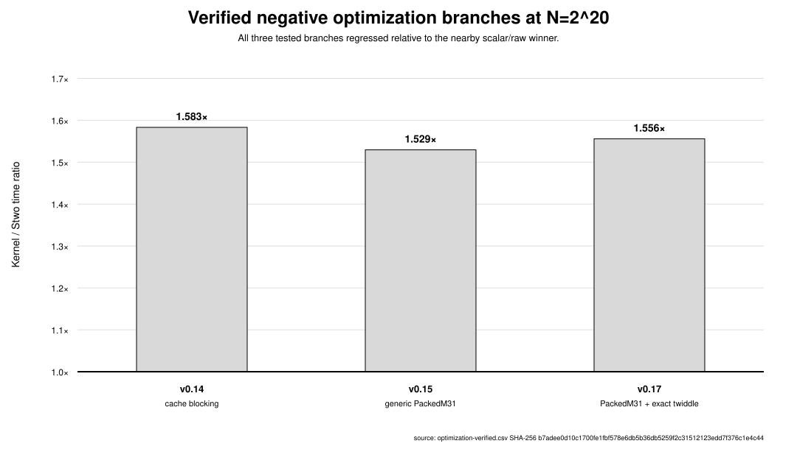
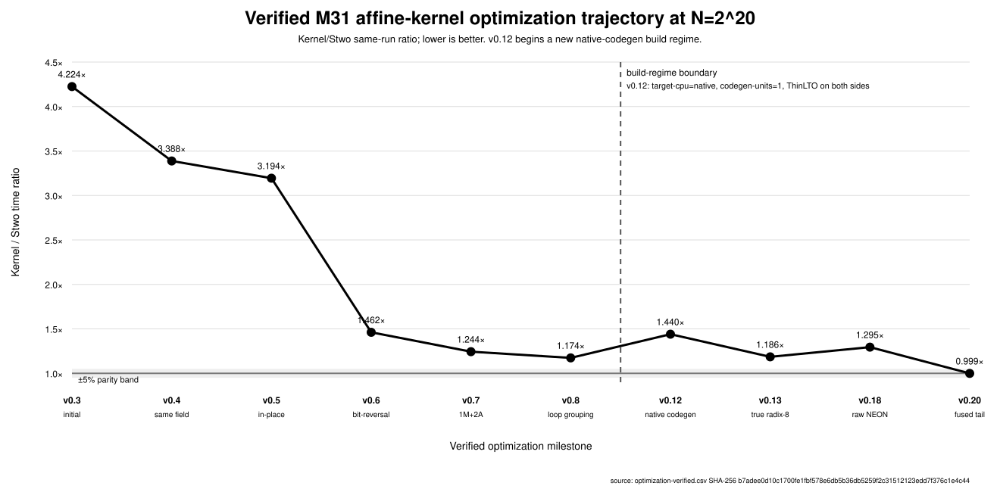
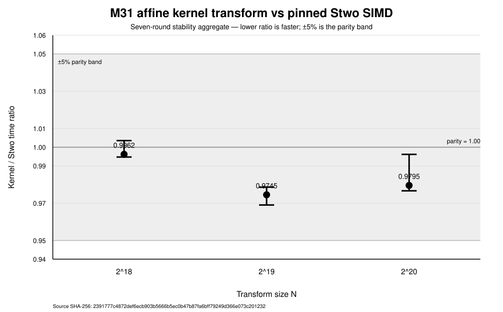
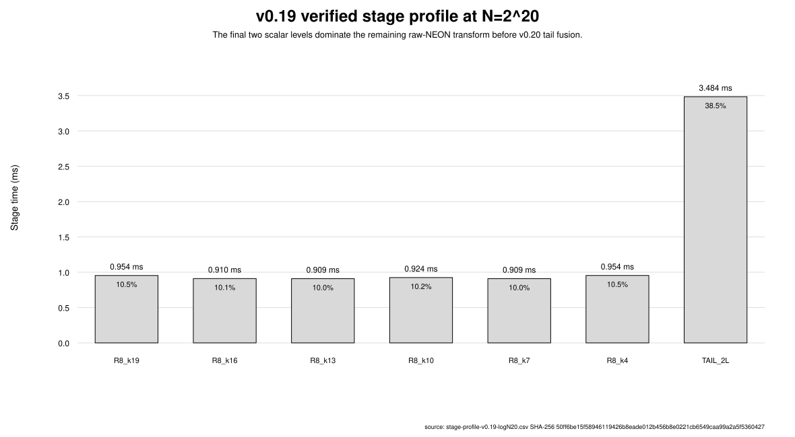

# Fast Affine Kernel-Basis Evaluation over Mersenne-31:
# Stable ARM64 Transform Parity with Stwo

**Status:** full research draft — benchmark and source frozen; host metadata,
figures, final proof audit, and publication formatting remain.

## Abstract

This paper continues the Boolean and affine kernel-polynomial program developed
in earlier Algorizk work. For a degree-two level sequence

\[
X_0=X,
\qquad
X_{i+1}=\phi(X_i),
\]

the inherited affine Mersenne specialization uses

\[
\phi(X)=X^2-2,
\qquad
K_y(X)=\prod_{i=0}^{m-1}(X_i+y_i),
\qquad
y\in\mathbb B^m.
\]

The prior recursive evaluation formula is

\[
U(X)=X\,A(\phi(X))+(X+1)B(\phi(X)).
\]

For implementation, we place the recursive branch coefficients in the
already-established one-coordinate Boolean-zeta coordinates

\[
(D,C)=(B,A+B).
\]

On paired affine preimages \(\pm\alpha\) of \(\beta\), the hot butterfly then
becomes

\[
U(+\alpha)=D(\beta)+\alpha C(\beta),
\qquad
U(-\alpha)=D(\beta)-\alpha C(\beta),
\]

with one field multiplication and two additions/subtractions.

The main contribution of the present paper is the source-frozen
Rust/ARM64 realization of this inherited affine kernel transform and the
experimental evidence explaining how it reaches production-class throughput.
The implementation combines a bit-reversed schedule with node-level twiddle
reuse, true three-level radix-8 register fusion, raw redundant M31 arithmetic,
direct ARM64 NEON widening multiplication, and a fused final two-level
microkernel. Several plausible alternatives—including generic `PackedM31`,
an exact Stwo twiddle multiplier inside the packed branch, naive cache
blocking, and a transpose/locality hypothesis—did not close the gap.

Against Stwo commit
`826591c6c371376810ca8213b5812d5daf6d5092`, the final seven-round stability
gate at \(N=2^{20}\) records a median kernel/Stwo ratio of
0.979510, an observed range [0.976630,0.996149], and 7/7 rounds
inside the \(\pm5\%\) parity band. Median transform times are
6.924750 ms for the affine kernel transform and 7.058000 ms for Stwo SIMD.

We therefore report **stable single-thread ARM64 native-transform parity**,
not a material speedup. The timed result assumes coefficients are already in
the Boolean-zeta/native coordinates; the
\((N/2)\log_2N\)-addition coordinate preparation is excluded. No end-to-end
prover or PCS performance claim is made.

## 1. Introduction

The kernel-polynomial program developed in earlier Algorizk work studies
polynomial representations indexed by the Boolean cube rather than by ordinary
degree. The original Boolean kernel basis is

\[
K_y(X)=\prod_{i=0}^{m-1}\left(X^{2^i}+y_i\right),
\qquad
y\in\mathbb B^m,
\]

with an exact Boolean zeta/Möbius change of coordinates and a separately
characterized low-degree filtration [Mkhida2026BooleanKernel].

A subsequent technical specification generalized the same construction through
a degree-two level sequence

\[
X_0=X,
\qquad
X_{i+1}=\phi(X_i),
\]

and defined

\[
K_y(X)=\prod_i(X_i+y_i).
\]

That work already established the recursive evaluation identity

\[
U(X)=X\,A(\phi(X))+(X+1)B(\phi(X)),
\]

as well as the affine Mersenne specialization

\[
\phi_{\rm aff}(X)=X^2-2,
\]

the paired affine evaluation domain, its rescaling to the Circle-STARK line
domain, and the exact affine-tower depth for Mersenne-type primes
[Mkhida2026KernelPCS]. Those mathematical results are background for the
present paper; they are not reintroduced as new results here.

The new question is a systems one:

> can the inherited affine kernel transform over M31 be realized at the same
> native-transform performance level as the production SIMD Circle FFT in
> Stwo?

The first implementation gave a discouraging answer. At
\(N=2^{20}\), the initial kernel implementation was more than four times
slower than Stwo SIMD. Replacing scalar arithmetic and eliminating obvious
memory traffic recovered only part of the gap. The decisive improvements came
from treating recursive coordinates, schedule, register lifetime, and M31
representation as one implementation problem.

### 1.1 Reusing the established Boolean-zeta coordinates

The prior Boolean kernel work already gives the one-coordinate zeta map

\[
Z_1=
\begin{pmatrix}
0&1\\
1&1
\end{pmatrix},
\]

which sends

\[
(\lambda_0,\lambda_1)
\longmapsto
(\lambda_1,\lambda_0+\lambda_1).
\]

In the affine recursive notation, this is exactly

\[
(A,B)\longmapsto(D,C)=(B,A+B).
\]

Substituting these coordinates into the inherited recursive formula gives

\[
U(X)=D(\phi(X))+X\,C(\phi(X)).
\]

For paired preimages \(\pm\alpha\) of \(\beta\),

\[
U(+\alpha)=D(\beta)+\alpha C(\beta),
\]

\[
U(-\alpha)=D(\beta)-\alpha C(\beta).
\]

Thus the hot transform uses the ideal binary butterfly cost

\[
1\mathrm M+2\mathrm A.
\]

The important point is one of provenance: this paper does not introduce a
parallel "sheared" basis. It reuses the already-established Boolean-zeta
coordinate change inside the affine kernel recursion.

### 1.2 From arithmetic parity to implementation parity

Matching the arithmetic count did not by itself match Stwo performance.

The optimization sequence identified the following requirements:

1. store recursive coordinates in a bit-reversed schedule so each node twiddle
   is reused across a contiguous block;
2. fuse three dependent binary stages while intermediates remain in registers;
3. represent M31 values directly as redundant `u32` words in \([0,P]\);
4. use direct ARM64 NEON widening multiplication and Mersenne folding;
5. profile stage costs rather than assume a cache-transpose bottleneck;
6. fuse the final \(k=1,0\) levels in a dedicated four-element NEON
   microkernel.

The negative results matter. Generic packed SIMD was slower than the scalar
winner at the target size, the exact Stwo twiddle multiplier did not rescue that
packed branch, naive cache blocking regressed, and stage profiling rejected the
proposed transpose/locality explanation. The final residual bottleneck was the
two-level scalar tail.

### 1.3 Contributions of the present paper

The present paper contributes:

**A provenance-preserving performance formulation.**
We show how the inherited affine recursion is executed in the canonical local
Boolean-zeta coordinates so that its native butterfly is 1M+2A, without
introducing new basis notation.

**A complete optimization/elimination record.**
We report the measured path from a \(>4\times\) gap to parity, including failed
branches and the profiler evidence used to reject them.

**A source-frozen ARM64 implementation.**
The final Rust implementation uses bit-reversed twiddle reuse, true radix-8
register fusion, raw redundant M31 arithmetic, direct NEON operations, and a
fused final two-level kernel.

**A stable comparison with pinned Stwo.**
At \(N=2^{18},2^{19},2^{20}\), the final implementation passes a
seven-round parity stability protocol against the pinned Stwo SIMD baseline.

### 1.4 Scope

The result is a native-transform comparison.

The Boolean-zeta/native coordinate preparation from the canonical affine
kernel coefficient table costs

\[
\frac N2\log_2N
\]

field additions and is excluded from timing. Domain/twiddle construction and
correctness-only canonicalization are also outside the timed transform.

Accordingly, this paper does not claim:

- end-to-end prover parity;
- PCS performance;
- a material speedup over Stwo;
- cross-architecture parity;
- novelty for the kernel basis, Boolean zeta/Möbius transform,
  \(\phi_{\rm aff}(X)=X^2-2\), or the affine/Circle-domain relation.

### 1.5 Organization

Section 2 recalls the inherited kernel-basis notation and affine M31
specialization. Section 3 identifies the hot 1M+2A form with the canonical
Boolean-zeta coordinates. Section 4 gives the bit-reversed execution schedule.
Section 5 documents the frozen ARM64 implementation. Section 6 records negative
results and eliminated hypotheses. Section 7 fixes the benchmark methodology,
and Section 8 reports the optimization trajectory and final stability result.
Sections 9 and 10 discuss the result and related work. Section 11 states future
work, with elimination or fusion of the coordinate-preparation boundary as the
highest-priority next question.

## 2. Mathematical setting and inherited kernel-basis framework

This paper continues the kernel-polynomial R&D developed in
*Mkhida, The Boolean Kernel Basis and Its Low-Degree Filtration over Arbitrary
Fields* and in the subsequent Algorizk affine-domain technical specification.
The present section therefore **inherits the established notation and results**
rather than defining a parallel basis.

### 2.1 Canonical Boolean kernel notation

Fix

\[
N=2^m,
\qquad
\mathbb B^m=\{0,1\}^m.
\]

For

\[
a=(a_0,\ldots,a_{m-1})\in\mathbb B^m,
\]

write

\[
|a|_2
=
\sum_{i=0}^{m-1}a_i2^i.
\tag{2.1}
\]

The original Boolean kernel basis is

\[
K_y(X)
=
\prod_{i=0}^{m-1}
\left(X^{2^i}+y_i\right),
\qquad
y\in\mathbb B^m.
\tag{2.2}
\]

For

\[
U(X)
=
\sum_{y\in\mathbb B^m}\lambda_yK_y(X)
=
\sum_{a\in\mathbb B^m}u_aX^{|a|_2},
\]

the established kernel-to-monomial coefficient relation is

\[
u_a
=
\sum_{y\ge \bar a}\lambda_y,
\tag{2.3}
\]

where \(\bar a\) is the Boolean complement of \(a\). Thus the coefficient
change is the Boolean zeta transform followed by complement, with inverse
given by Boolean Möbius inversion [Mkhida2026BooleanKernel].

At one coordinate, the zeta map is

\[
Z_1
=
\begin{pmatrix}
0&1\\
1&1
\end{pmatrix},
\tag{2.4}
\]

so

\[
(\lambda_0,\lambda_1)
\longmapsto
(\lambda_1,\lambda_0+\lambda_1).
\tag{2.5}
\]

This local map will reappear directly in the performance transform of
Section 3.

### 2.2 Level sequences and the affine specialization

The subsequent affine-domain work replaces the fixed squaring sequence by a
general degree-two level map

\[
\phi:\mathbb F\to\mathbb F
\]

and defines

\[
X_0=X,
\qquad
X_{i+1}=\phi(X_i).
\tag{2.6}
\]

Two instances were identified in that work:

\[
\phi_{\mathrm{mult}}(X)=X^2,
\qquad
\phi_{\mathrm{aff}}(X)=X^2-2.
\tag{2.7}
\]

The current paper uses exclusively

\[
\boxed{
\phi(X)=\phi_{\mathrm{aff}}(X)=X^2-2.
}
\tag{2.8}
\]

The affine specialization of the kernel basis is therefore

\[
\boxed{
K_y(X)
=
\prod_{i=0}^{m-1}(X_i+y_i),
\qquad
y\in\mathbb B^m.
}
\tag{2.9}
\]

We retain the symbol \(K_y\), as in the prior technical specification; the
level sequence distinguishes the affine specialization from (2.2).

### 2.3 Inherited recursive structure

Write

\[
y=(y_0,\bar y),
\qquad
\bar y\in\mathbb B^{m-1}.
\]

The prior recursive-structure proposition gives

\[
\boxed{
K_y(X)
=
(X_0+y_0)K_{\bar y}(X_1).
}
\tag{2.10}
\]

Now let

\[
\lambda:\mathbb B^m\to\mathbb F
\]

and

\[
U(X)
=
\sum_{y\in\mathbb B^m}\lambda(y)K_y(X).
\tag{2.11}
\]

Following the canonical notation, write

\[
A=\lambda(0,\cdot),
\qquad
B=\lambda(1,\cdot),
\]

for the two lower-dimensional coefficient tables, with associated lower-level
kernel polynomials \(A(X_1)\) and \(B(X_1)\).

The inherited recursive evaluation formula is

\[
\boxed{
U(X)
=
X\,A(\phi(X))
+
(X+1)B(\phi(X)).
}
\tag{2.12}
\]

This is the starting algebraic identity for the entire benchmark. It is not a
new result of the present paper [Mkhida2026KernelPCS].

### 2.4 Affine paired domains

For the affine map

\[
\phi(X)=X^2-2,
\]

the two preimages of

\[
\beta=\phi(\alpha)
\]

are

\[
+\alpha,
\qquad
-\alpha,
\]

with

\[
\alpha^2=\beta+2.
\tag{2.13}
\]

The prior affine-domain construction recursively uses these pairs. For a
Mersenne-type prime

\[
p=2^n-1\equiv3\pmod4,
\]

the square root operation used in the construction is

\[
\sqrt a=a^{(p+1)/4}
\]

when the required quadratic-residue condition holds.

The earlier technical specification proves that, under

\[
X=2Z,
\]

the affine map is rescaled to the Circle line-doubling map:

\[
\phi_{\mathrm{aff}}(2Z)
=
2(2Z^2-1).
\tag{2.14}
\]

Therefore the **domain-level** affine/Circle correspondence is inherited prior
R&D, not a new result of this paper [Mkhida2026KernelPCS].

For M31,

\[
p=2^{31}-1,
\]

the same prior work proves the affine tower reaches depth \(29\), i.e. domain
size \(2^{29}\), before the pairing condition fails.

### 2.5 What is new in the present paper

The new question is implementation-level:

> given the already-defined affine kernel transform (2.12), can its native
> evaluation be represented and scheduled so that its ARM64 throughput reaches
> the production Stwo SIMD transform?

The next section answers the first half of that question by reusing the
existing Boolean-zeta coordinates inside the affine recursion.

## 3. Boolean-zeta coordinates and the 1M+2A butterfly

### 3.1 Original affine kernel recursion

Evaluate (2.12) at a paired preimage

\[
+\alpha,-\alpha
\]

of

\[
\beta=\phi(\alpha).
\]

We obtain

\[
U(+\alpha)
=
\alpha A(\beta)+(\alpha+1)B(\beta),
\tag{3.1}
\]

and

\[
U(-\alpha)
=
-\alpha A(\beta)+(1-\alpha)B(\beta).
\tag{3.2}
\]

Equivalently,

\[
U(+\alpha)
=
B(\beta)
+
\alpha\bigl(A(\beta)+B(\beta)\bigr),
\tag{3.3}
\]

\[
U(-\alpha)
=
B(\beta)
-
\alpha\bigl(A(\beta)+B(\beta)\bigr).
\tag{3.4}
\]

If the recursive state is stored directly as \((A,B)\), the sum \(A+B\)
must be formed at the butterfly boundary.

### 3.2 Reuse of the canonical local zeta map

Define

\[
\boxed{
D=B,
\qquad
C=A+B.
}
\tag{3.5}
\]

Then

\[
\boxed{
U(X)
=
D(\phi(X))
+
X\,C(\phi(X)).
}
\tag{3.6}
\]

The important provenance point is that (3.5) is not a newly invented
two-dimensional change of basis. It is exactly the established one-coordinate
Boolean zeta transform (2.5):

\[
(A,B)
\longmapsto
(B,A+B)
=
(D,C).
\tag{3.7}
\]

Thus the implementation evaluates the affine kernel polynomial in the same
local zeta coordinates already present in the original kernel-basis program.

### 3.3 Native butterfly

At the paired preimages,

\[
U(+\alpha)
=
D(\beta)+\alpha C(\beta),
\tag{3.8}
\]

\[
U(-\alpha)
=
D(\beta)-\alpha C(\beta).
\tag{3.9}
\]

Writing

\[
d=D(\beta),
\qquad
c=C(\beta),
\]

the butterfly is

\[
t=\alpha c,
\]

\[
w_+=d+t,
\qquad
w_-=d-t.
\tag{3.10}
\]

Hence the native arithmetic cost is

\[
\boxed{1\mathrm M+2\mathrm A}.
\tag{3.11}
\]

The improvement relative to a direct \((A,B)\) implementation is therefore
best understood as **moving the existing Boolean-zeta coordinate change
outside the hot butterfly**, not as introducing a separate new polynomial
basis.

### 3.4 Recursive/global coordinate transform

Applied along all Boolean coordinates, the local map (2.5) is the established
Boolean zeta transform (up to the same complement/ordering convention used in
the original kernel-basis paper).

Consequently, the preparation of the native 1M+2A representation costs

\[
\frac N2\log_2N
\]

field additions under the standard in-place zeta schedule.

This conversion is excluded from the transform benchmark, exactly as already
stated in the methodology. The measured claim is therefore a
**native-representation transform claim**.

### 3.5 Native arithmetic complexity

Let

\[
N=2^m.
\]

There are

\[
\frac N2
\]

butterflies at each of the \(m\) recursive levels. Therefore the native
zeta-coordinate transform uses

\[
\boxed{
\frac N2\log_2N
}
\]

field multiplications and

\[
\boxed{
N\log_2N
}
\]

field additions/subtractions.

The arithmetic count matches the ideal binary count used by Circle FFT.
The novelty claim of this paper is not that such a count exists abstractly;
it is the source-frozen realization of the inherited affine kernel transform
at Stwo-class ARM64 throughput.

## 4. Bit-reversed execution schedule

The recursive algebra above was already available in the prior R&D. The
largest early implementation gain in the present project came instead from
changing how the same recursion is laid out in memory.

### 4.1 Recursive schedule and twiddle reuse

At recursion level \(k\), each node has one paired-preimage parameter
\(\alpha\), shared by every butterfly belonging to that node.

The first implementation followed the recursive coefficient layout too
literally. This obscured contiguous reuse of the node twiddle and created a
large performance gap even after field arithmetic was matched.

### 4.2 Bit-reversed coefficient order

The winning schedule stores the recursive Boolean coordinates in bit-reversed
order. For

\[
j=\sum_{i=0}^{m-1}j_i2^i,
\]

define

\[
\operatorname{rev}_m(j)
=
\sum_{i=0}^{m-1}j_i2^{m-1-i}.
\tag{4.1}
\]

After this permutation, one recursive node occupies a contiguous memory block.

At stage

\[
k=m-1,m-2,\ldots,0,
\]

set

\[
\operatorname{span}=2^k.
\]

For node index \(h\), let

\[
\operatorname{base}=h\,2^{k+1}
\]

and let \(\alpha_{k,h}\) be its twiddle. For

\[
0\le \ell<\operatorname{span},
\]

execute

\[
d=a[\operatorname{base}+\ell],
\]

\[
c=a[\operatorname{base}+\ell+\operatorname{span}],
\]

\[
t=\alpha_{k,h}c,
\]

\[
a[\operatorname{base}+\ell]=d+t,
\]

\[
a[\operatorname{base}+\ell+\operatorname{span}]=d-t.
\tag{4.2}
\]

Thus the single twiddle \(\alpha_{k,h}\) is loaded once for the node and reused
across the entire contiguous block.

### 4.3 Arithmetic invariance

The schedule changes neither the inherited affine transform nor its operation
count. It preserves

\[
\frac N2\log_2N
\]

multiplications and

\[
N\log_2N
\]

additions/subtractions.

Its effect is architectural: contiguous node blocks make twiddle reuse,
register fusion, and direct SIMD implementation practical.

### 4.4 True three-level fusion

The final implementation fuses three dependent binary stages at a time while
their intermediate values remain live in registers. This is a true radix-8
microkernel, not merely loop grouping.

The last two stages are handled by a dedicated four-element NEON microkernel
rather than a scalar fallback. Section 6 shows that profiling this tail was the
decisive final step from a roughly \(1.30\times\) gap to stable parity.

## 5. ARM64 implementation

The final implementation keeps the mathematical transform of Sections 3–4
unchanged and specializes only its field representation, SIMD arithmetic, and
stage fusion for AArch64. This section describes the exact winning source
frozen in repository tag `v0.20.1-parity`.

The hot path does not use Stwo's `M31` or `PackedM31` types. Transform values
and twiddles are stored directly as `u32`, and AArch64 NEON intrinsics operate
on these raw words. Conversion back to canonical field elements is used only at
the correctness boundary and is excluded from the timed transform.

### 5.1 Redundant M31 representation

Let

\[
P=2^{31}-1.
\]

The implementation represents a field element by a word

\[
a\in[0,P],
\]

where both \(0\) and \(P\) represent the zero residue. Thus the internal
representation is redundant by exactly one value.

This choice is useful because addition and subtraction can be reduced with
unsigned word operations and a lane-wise minimum, without first forcing every
intermediate value into the canonical interval \([0,P-1]\).

The source defines

\[
\operatorname{add}(a,b)
=
\min(c,c-P\bmod 2^{32}),
\qquad
c=a+b,
\tag{5.1}
\]

and

\[
\operatorname{sub}(a,b)
=
\min(c,c+P\bmod 2^{32}),
\qquad
c=a-b\bmod 2^{32}.
\tag{5.2}
\]

For \(a,b\in[0,P]\), (5.1) and (5.2) return representatives in
\([0,P]\) congruent to \(a+b\) and \(a-b\) modulo \(P\).

**Lemma 5.1 (redundant addition and subtraction).**
Equations (5.1) and (5.2) preserve the redundant interval \([0,P]\) and compute
the correct residue modulo \(P\).

**Proof.**
For addition,

\[
0\le a+b\le 2P=2^{32}-2,
\]

so the unsigned addition does not overflow. If \(c<P\), then the wrapped word
\(c-P\bmod2^{32}\) is larger than \(c\), and the minimum returns \(c\).
If \(c\ge P\), the ordinary difference \(c-P\) lies in \([0,P]\), so the
minimum returns \(c-P\).

For subtraction, if \(a\ge b\), then \(c=a-b\in[0,P]\) and the minimum keeps
\(c\). If \(a<b\), unsigned subtraction gives
\(c=2^{32}-(b-a)\), while

\[
c+P\bmod2^{32}=P-(b-a)\in[0,P-1].
\]

The minimum selects this reduced representative. In both cases the returned
word is congruent to \(a-b\pmod P\). \(\square\)

Canonicalization is therefore a boundary operation only:

\[
\operatorname{canon}(a)
=
\begin{cases}
0,&a=P,\\
a,&a\ne P.
\end{cases}
\tag{5.3}
\]

### 5.2 Mersenne multiplication

For two redundant representatives \(a,b\in[0,P]\), form the 64-bit product

\[
z=ab.
\]

Since \(a,b\le P\),

\[
0\le z\le P^2<2^{62}.
\]

Using

\[
2^{31}\equiv1\pmod P,
\]

split

\[
z=z_{\mathrm{lo}}+2^{31}z_{\mathrm{hi}},
\]

where

\[
z_{\mathrm{lo}}=z\mathbin{\&}P,
\qquad
z_{\mathrm{hi}}=z\gg31.
\]

The first Mersenne fold is

\[
r=z_{\mathrm{lo}}+z_{\mathrm{hi}}.
\tag{5.4}
\]

For \(z\le P^2\), this satisfies

\[
0\le r<2P.
\]

The implementation then performs one conditional subtraction,

\[
\operatorname{mul}(a,b)
=
\min(r,r-P\bmod2^{32}),
\tag{5.5}
\]

which restores the redundant invariant \([0,P]\).

This final subtraction is necessary: an earlier experimental version stopped
after (5.4), incorrectly assuming that the first fold was already at most
\(P\). The correctness gate exposed that error before timing.

### 5.3 Four-lane NEON arithmetic

On AArch64, the principal SIMD state is

\[
\texttt{uint32x4\_t},
\]

containing four redundant M31 representatives.

The vector addition and subtraction helpers are the direct lane-wise analogues
of (5.1) and (5.2), implemented with `vaddq_u32`, `vsubq_u32`, and
`vminq_u32`.

AArch64's `vmull_u32` widens two \(32\)-bit lanes to two \(64\)-bit products.
Consequently the four-lane multiply-by-twiddle helper splits one
`uint32x4_t` into its low and high two-lane halves. For a scalar twiddle
\(\alpha\), it performs

1. `vdup_n_u32(alpha)` to broadcast the twiddle;
2. two `vmull_u32` widening multiplications;
3. the Mersenne reduction (5.4)–(5.5) independently on both 64-bit pairs;
4. `vcombine_u32` to rebuild the four-lane result.

The reduction helper computes

\[
z_{\mathrm{lo}}=z\mathbin{\&}P,
\qquad
z_{\mathrm{hi}}=z\gg31,
\qquad
r=z_{\mathrm{lo}}+z_{\mathrm{hi}},
\]

narrows the folded values to \(32\) bits, and applies the final lane-wise
conditional subtraction by \(P\).

The resulting primitive implements four independent products

\[
(c_0,c_1,c_2,c_3)
\longmapsto
(\alpha c_0,\alpha c_1,\alpha c_2,\alpha c_3)
\]

in the redundant representation.

### 5.4 True three-level radix-8 fusion

The bit-reversed schedule of Section 4 exposes dependent transform stages whose
intermediate values can remain in registers. The final implementation fuses
three consecutive binary levels into the function `neon_radix8_block`.

For one inner offset, the kernel loads eight four-lane vectors

\[
x_0,x_1,\ldots,x_7,
\]

corresponding to eight subblocks separated by the current span. These
\(8\times4=32\) field elements are then carried through three complete transform
levels before any intermediate vector is written back to memory.

The first fused level applies the common parent twiddle \(\alpha_0\) to the
upper four vectors and forms

\[
\begin{aligned}
y_0&=x_0+\alpha_0x_4,&
y_4&=x_0-\alpha_0x_4,\\
y_1&=x_1+\alpha_0x_5,&
y_5&=x_1-\alpha_0x_5,\\
y_2&=x_2+\alpha_0x_6,&
y_6&=x_2-\alpha_0x_6,\\
y_3&=x_3+\alpha_0x_7,&
y_7&=x_3-\alpha_0x_7.
\end{aligned}
\tag{5.6}
\]

The second level uses the two child twiddles
\(\alpha_{10},\alpha_{11}\), and the third uses the four grandchildren
twiddles

\[
\alpha_{20},\alpha_{21},\alpha_{22},\alpha_{23}.
\]

Thus one fused block consumes exactly the seven recursion-node twiddles of a
depth-three binary subtree.

At the vector-instruction level, one 32-element fused block performs

- \(12\) four-lane multiply-by-scalar operations;
- \(24\) four-lane additions/subtractions;
- eight 128-bit data loads;
- eight 128-bit data stores.

Equivalently, across the three levels this represents

- \(48\) scalar field multiplications;
- \(96\) scalar field additions/subtractions;
- \(48\) scalar butterflies.

The important memory property is that the intermediate
\(y_i\) and \(z_i\) values remain in NEON registers. The block loads each of its
eight vectors once and stores only the final \(w_i\) vectors after all three
levels are complete.

This is what we mean by **true radix-8 register fusion**. Earlier experiments
that merely grouped three loops while storing the full array between stages did
not obtain the same effect.

### 5.5 Residual single-level vector stages

The transform driver consumes three levels at a time while at least five levels
remain:

\[
\texttt{while top >= 5}.
\]

This rule intentionally preserves the final two levels for the specialized
tail kernel described below.

Depending on \(m\bmod3\), one or two levels can remain above that tail after
the radix-8 groups are exhausted. These levels use `neon_level4`, a direct
four-lane implementation of one 1M+2A stage:

\[
t=\alpha c,
\qquad
d'=d+t,
\qquad
c'=d-t.
\]

The values are loaded as two four-lane vectors, transformed, and stored back.

For example, at \(m=20\), the driver executes six radix-8 groups beginning at

\[
k=19,16,13,10,7,4
\]

and then passes exactly \(k=1,0\) to the fused tail.

### 5.6 Fusing the final two levels

Stage profiling showed that after the high-level NEON work had been optimized,
the last two scalar levels became disproportionately expensive. The final
implementation therefore treats \(k=1\) and \(k=0\) as one four-element
microkernel, `neon_tail2_block`.

Consider one contiguous input block

\[
[x_0,x_1,x_2,x_3].
\]

For the \(k=1\) level, the bit-reversed schedule pairs

\[
(x_0,x_2),
\qquad
(x_1,x_3)
\]

under one shared twiddle \(\alpha_1\). The implementation loads the four words
with one 128-bit `vld1q_u32`, interprets

\[
d=[x_0,x_1],
\qquad
c=[x_2,x_3],
\]

and computes

\[
t_1=\alpha_1c,
\]

\[
y_{\mathrm{lo}}=d+t_1=[y_0,y_1],
\]

\[
y_{\mathrm{hi}}=d-t_1=[y_2,y_3].
\tag{5.7}
\]

The \(k=0\) level requires the pairs

\[
(y_0,y_1),
\qquad
(y_2,y_3),
\]

with two independent child twiddles. The source uses NEON unzip operations to
rearrange the intermediate lanes as

\[
\operatorname{even}=[y_0,y_2],
\qquad
\operatorname{odd}=[y_1,y_3].
\]

It then loads the two child twiddles as one two-lane vector,

\[
\alpha=[\alpha_{0,L},\alpha_{0,R}],
\]

and performs the lane-wise vector product

\[
t_0=\alpha\odot\operatorname{odd}.
\]

The final even and odd outputs are

\[
z_{\mathrm{even}}
=
\operatorname{even}+t_0
=
[z_0,z_2],
\]

\[
z_{\mathrm{odd}}
=
\operatorname{even}-t_0
=
[z_1,z_3].
\tag{5.8}
\]

Two NEON zip operations restore the natural block order

\[
[z_0,z_1,z_2,z_3],
\]

which is written with one 128-bit store.

Therefore the four transform values are loaded once, both remaining levels are
computed without an intermediate array store, and the four final values are
stored once.

### 5.7 Final transform driver

The winning in-place driver can be summarized as follows.

1. Let \(m=\log_2N\).
2. While at least five levels remain, consume three levels with a true
   radix-8 NEON block.
3. If one or two vectorizable levels remain above the final two, execute them
   with the four-lane single-stage kernel.
4. When exactly two levels remain, execute the fused four-element tail.
5. Use the scalar raw implementation only as a general fallback for
   small/unusual depths; this fallback is not used by the final benchmark sizes
   \(2^{18},2^{19},2^{20}\).

The benchmark wrapper copies the immutable input into a working output buffer
and then calls this in-place driver. Consequently the reported transform timing
includes that input copy. Conversion from raw redundant words back to canonical
M31 elements is not part of the timed path.

### 5.8 Correctness boundary

The optimized implementation is not accepted on performance alone. Before the
benchmark proceeds, the code canonicalizes the raw output at the test boundary
using (5.3) and compares it against the scalar true-radix-8 transform and the
original kernel evaluation on the small-\(N\) correctness suite.

This ordering was operationally important during development: the first raw
Mersenne multiplication implementation omitted the final subtraction in
(5.5), and the correctness gate failed before any timing result was accepted.

The final source therefore separates three concerns:

- redundant arithmetic inside the hot path;
- exact equivalence of the optimized transform to the reference computation;
- performance measurement only after the correctness gate passes.

## 6. Negative results and design elimination

The final implementation was not obtained by monotonically adding
optimizations. Several plausible directions either produced only modest gains
or made the transform slower. We report these results because they isolate the
mechanisms that actually closed the gap to the Stwo baseline.

Unless otherwise stated, ratios in this section are **same-run**
kernel/Stwo ratios from the corresponding experiment. Absolute times from
different build regimes should not be compared as though they came from one
continuous machine configuration.

### 6.1 Field representation alone did not explain the original gap

The first implementation at \(N=2^{20}\) required approximately

\[
44.798	ext{ ms}
\]

against a same-run Stwo SIMD time of

\[
10.605	ext{ ms},
\]

for a ratio of approximately

\[
4.224.
\]

Replacing the custom field path with Stwo's scalar base-field representation
reduced the kernel time to approximately

\[
36.409	ext{ ms},
\]

while Stwo SIMD measured \(10.747\) ms in the same run, giving a ratio of

\[
3.388.
\]

Thus field arithmetic mattered, but it accounted for only a fraction of the
initial performance gap. The dominant problem was elsewhere.

### 6.2 In-place memory traffic was not the dominant bottleneck

An in-place split reduced the \(N=2^{20}\) kernel time from about
\(36.4\) ms to

\[
33.755	ext{ ms},
\]

with a same-run Stwo SIMD time of \(10.568\) ms. The resulting ratio was

\[
3.194.
\]

This improvement was useful but too small to support the hypothesis that
out-of-place ping-pong traffic was the main source of the gap.

### 6.3 Scheduling and twiddle reuse were decisive

The largest early improvement came from changing the execution order rather
than the field arithmetic. The bit-reversed schedule of Section 4 reduced the
kernel time at \(N=2^{20}\) to

\[
15.462	ext{ ms},
\]

against \(10.579\) ms for Stwo SIMD, giving

\[
1.462.
\]

This result eliminated more than half of the remaining gap in one step and
identified recursion-node layout and twiddle reuse as first-order concerns.

### 6.4 The 1M+2A shear brought the scalar transform near Stwo's scalar CPU path

After changing the recursive state from \((A,B)\) to the sheared
\((C,D)\) representation, the native butterfly dropped from one multiplication
plus three additions/subtractions to one multiplication plus two.

At \(N=2^{20}\), the resulting scalar transform measured

\[
13.326	ext{ ms},
\]

compared with

\[
12.802	ext{ ms}
\]

for the Stwo CPU path and \(10.715\) ms for Stwo SIMD. Thus

\[
rac{T_\mathrm{kernel}}{T_\mathrm{Stwo,CPU}}
pprox1.041
\]

and

\[
rac{T_\mathrm{kernel}}{T_\mathrm{Stwo,SIMD}}
pprox1.244.
\]

This showed that the remaining problem was primarily vectorization/code
generation rather than a scalar arithmetic-count disadvantage.

### 6.5 Loop grouping was not the same as register fusion

A three-level loop-grouped scalar implementation reduced the time further to

\[
12.732	ext{ ms}
\]

against \(10.846\) ms for Stwo SIMD, ratio \(1.174\). However, that version
still wrote the full array between levels. It therefore motivated the later
distinction between *loop fusion* and *true register fusion*.

### 6.6 Generic PackedM31 vectorization failed at the target size

The first generic packed implementation measured about

\[
14.101	ext{ ms}
\]

at \(N=2^{20}\), slower than the scalar fused implementation and far behind
Stwo SIMD.

A later true packed radix-8 version remained slower. In the v0.15 gate,

\[
T_\mathrm{scalar}=9.465	ext{ ms},
\qquad
T_\mathrm{packed}=10.777	ext{ ms},
\qquad
T_\mathrm{Stwo}=7.046	ext{ ms}.
\]

Thus

\[
rac{T_\mathrm{packed}}{T_\mathrm{scalar}}
pprox1.139
\]

and

\[
rac{T_\mathrm{packed}}{T_\mathrm{Stwo}}
pprox1.529.
\]

The conclusion is deliberately narrow: the tested generic `PackedM31`
realizations were not an effective SIMD representation for this transform on
the measured ARM64 machine. This does not imply that portable packed field
types are universally inferior.

### 6.7 Stwo's exact twiddle multiplier did not rescue the packed branch

The final packed-field gate combined true packed radix-8 fusion with the exact
Stwo doubled-twiddle multiplier. At \(N=2^{20}\),

\[
T_\mathrm{scalar}=9.474	ext{ ms},
\]

\[
T_\mathrm{packed,exact}=10.855	ext{ ms},
\]

and

\[
T_\mathrm{Stwo}=6.978	ext{ ms}.
\]

The exact packed path was therefore

\[
1.146	imes
\]

slower than the scalar kernel and

\[
1.556	imes
\]

the Stwo SIMD time. This triggered the experimental stop rule for the
`PackedM31` branch.

### 6.8 Naive cache blocking made the transform slower

A cache-blocked true-radix-8 implementation was tested after register fusion.
At \(N=2^{20}\), the unblocked baseline was approximately

\[
9.483	ext{ ms},
\]

whereas the best tested block size gave approximately

\[
11.248	ext{ ms}.
\]

The hypothesis that a simple subtree blocking scheme would improve locality was
therefore rejected.

### 6.9 Raw redundant NEON helped, but did not initially close the gap

Replacing generic packed arithmetic with the raw redundant representation and
direct AArch64 NEON produced a real improvement. At \(N=2^{18}\) and
\(2^{19}\), the raw-NEON path was roughly \(27\%\) faster than the scalar
winner.

At \(N=2^{20}\), however,

\[
T_\mathrm{scalar}=9.480	ext{ ms},
\qquad
T_\mathrm{rawNEON}=9.141	ext{ ms},
\qquad
T_\mathrm{Stwo}=7.060	ext{ ms},
\]

so the raw-NEON gain over scalar had collapsed to only about \(3.7\%\), and

\[
rac{T_\mathrm{rawNEON}}{T_\mathrm{Stwo}}
pprox1.295.
\]

This result motivated a stage-by-stage profile rather than another arithmetic
variant.

### 6.10 Stage profiling rejected the transpose/locality hypothesis

The stage profiler timed each three-level radix-8 group independently at
\(N=2^{20}\). The six groups were balanced to within approximately

\[
1.05	imes
\]

between fastest and slowest.

The final two scalar levels, by contrast, consumed approximately

\[
3.484	ext{ ms},
\]

or about

\[
38.5\%
\]

of the transform time.

Since the high radix-8 groups carried essentially equal arithmetic work and
showed only a small timing spread, the data did not support a transpose or
high-level cache-locality explanation for the residual gap. The remaining
bottleneck was the scalar tail.

### 6.11 Fusing the final two levels closed the gap

The final optimization changed only the last \(k=1\) and \(k=0\) levels.
At \(N=2^{20}\), the same-run comparison was

\[
T_\mathrm{old\ rawNEON}=9.189	ext{ ms},
\]

\[
T_\mathrm{fused\ tail}=6.917	ext{ ms},
\]

\[
T_\mathrm{Stwo}=6.921	ext{ ms}.
\]

Thus

\[
rac{T_\mathrm{old}}{T_\mathrm{fused}}
pprox1.328,
\]

while

\[
rac{T_\mathrm{fused}}{T_\mathrm{Stwo}}
pprox0.999.
\]

The final two-level specialization therefore reduced the prior raw-NEON
transform time by roughly one quarter and moved the kernel transform into
same-run parity with Stwo SIMD.

### 6.11 Verified negative-branch figure

Figure 1 collects the three negative branches for which archived
\(N=2^{20}\) CSV evidence was recovered and hashed: naive cache blocking
(v0.14), generic `PackedM31` true radix-8 (v0.15), and the packed radix-8
branch using Stwo's exact twiddle multiplier (v0.17). These are ablations,
not points on a monotone optimization curve.

The source values and source-CSV SHA-256 identifiers are recorded in
`paper/evidence/optimization-verified.csv` and `paper/FIGURE_PROVENANCE.md`.

## 7. Experimental methodology

### 7.1 Baseline and source pinning

All final comparisons use the public Stwo repository pinned at commit

`826591c6c371376810ca8213b5812d5daf6d5092`.

The benchmark source and parity checkpoint are frozen in repository tag

`v0.20.1-parity`.

The canonical Algorizk experimental record is Desk `LAB-010`, run `14`.

### 7.2 Hardware scope

The headline result is intentionally restricted to the measured Apple ARM64
host. Before submission, the reproducibility appendix must record the exact
machine model, Apple chip, memory size, macOS version, Rust toolchain version,
and relevant power/thermal conditions.

No x86_64, GPU, FPGA, or multi-thread parity claim is made in this paper.

### 7.3 Build policy

For the final optimization regime, both the kernel benchmark and the pinned
Stwo baseline are compiled with the same high-level Rust build policy:

- release mode;
- `-C target-cpu=native`;
- release codegen units equal to \(1\);
- ThinLTO;
- `RAYON_NUM_THREADS=1`.

This build policy was introduced at v0.12. Earlier optimization-history rows are
retained because they document the search process, but they are labeled as a
different build regime and are not used to infer absolute speedup across the
regime boundary.

### 7.4 Correctness before timing

Every accepted performance result is preceded by an exact correctness gate.

The final benchmark checks the optimized raw-NEON output, after boundary
canonicalization, against the scalar true-radix-8 transform and the original
kernel transform over small powers of two. Earlier stages of development also
used brute-force/reference evaluations for small sizes.

A failed correctness gate terminates the benchmark before timing. This policy
caught the missing final subtraction in the first raw Mersenne multiplication
implementation.

### 7.5 Timed and untimed work

The reported kernel timing measures the native sheared-basis transform.

The timed kernel wrapper includes copying the immutable input coefficients into
the working output buffer before the in-place transform. Canonicalization of
the redundant M31 output is excluded.

The following work is outside the timed native transform:

- construction of the recursive domain/twiddle hierarchy;
- conversion of twiddles into the raw representation;
- conversion of canonical kernel-basis coefficients into the fully sheared
  recursive representation;
- correctness-only canonicalization after timing.

The basis shear therefore remains an explicit end-to-end limitation rather
than a hidden cost.

### 7.6 Native-representation comparison

The benchmark compares each transform in its native coefficient
representation:

- the Algorizk kernel transform is timed on fully sheared kernel coefficients;
- Stwo is timed on its native Circle-transform representation.

The comparison is therefore a transform-throughput comparison, not a claim that
the two bases, domains, or surrounding prover pipelines are identical.

### 7.7 Same-run ratios

Because machine state and compiler behavior can shift absolute timing, the
primary metric throughout development is the same-run ratio

\[
R=
rac{T_\mathrm{kernel}}{T_\mathrm{Stwo,SIMD}}.
\]

Interpretation is:

- \(R>1\): kernel slower;
- \(R<1\): kernel faster in that run;
- \(Rpprox1\): performance parity.

For the final claim we do not interpret a small sub-unit ratio as a material
speedup. Instead, we use a stability protocol.

### 7.8 Final stability protocol

The final stability gate executes seven independent benchmark rounds. Each
round uses nine internal repetitions for benchmark points at

\[
N=2^{18},\quad2^{19},\quad2^{20}.
\]

For each size, the report stores

- the median kernel/Stwo ratio across rounds;
- minimum and maximum observed ratio;
- median kernel transform time;
- median Stwo SIMD time;
- the number of rounds inside the parity band

\[
[0.95,1.05].
\]

The predeclared stability decision at the largest size is:

- **stable parity** if the median ratio lies in \([0.97,1.03]\) and at least
  five of seven rounds lie inside the \(\pm5\%\) band;
- **provisional parity** if the median lies inside \([0.95,1.05]\) without
  satisfying the stronger criterion;
- otherwise, no parity claim.

### 7.9 Why the final claim is parity rather than speedup

The final median ratio is below one, but the experiment was designed to test
whether the transform can reach the same performance class as Stwo, not to
establish a statistically significant small speedup.

Accordingly, the manuscript uses the conservative statement

> stable native-transform performance parity with pinned Stwo SIMD

rather than "faster than Stwo."

## 8. Results

### 8.1 Optimization trajectory

Table 1 summarizes the major implementation milestones at
\(N=2^{20}\). Ratios are same-run kernel/Stwo SIMD ratios. The build-policy
boundary at v0.12 is shown explicitly.

| Version / milestone | Build regime | Kernel ms | Stwo SIMD ms | Kernel/Stwo | Main change |
|---|---:|---:|---:|---:|---|
| v0.3 initial | A | 44.798 | 10.605 | 4.224 | initial recursive kernel |
| v0.4 same-field | A | 36.409 | 10.747 | 3.388 | Stwo scalar base-field representation |
| v0.5 in-place | A | 33.755 | 10.568 | 3.194 | remove out-of-place split traffic |
| v0.6 bit-reversed | A | 15.462 | 10.579 | 1.462 | contiguous schedule + twiddle reuse |
| v0.7 1M+2A shear | A | 13.326 | 10.715 | 1.244 | sheared recursive state |
| v0.8 grouped scalar | A | 12.732 | 10.846 | 1.174 | three-level loop grouping |
| v0.13 true scalar R8 | B | 9.450 | 7.970 | 1.186 | true register fusion |
| v0.15 true packed R8 | B | 10.777 | 7.046 | 1.529 | generic packed SIMD; regression |
| v0.17 exact packed twiddle | B | 10.855 | 6.978 | 1.556 | exact Stwo twiddle multiplier; regression |
| v0.18.2 raw NEON | B | 9.141 | 7.060 | 1.295 | raw redundant M31 + direct NEON |
| v0.20 fused tail | B | 6.917 | 6.921 | 0.999 | fuse/vectorize final two levels |

Build regime A denotes the earlier benchmark configuration. Build regime B
starts at v0.12, where both implementations use native CPU code generation,
one release codegen unit, and ThinLTO.

The table should therefore be read as a sequence of **same-run competitive
ratios**, not as one absolute timing series across the A/B boundary.

### 8.1.1 Verified optimization trajectory

Figure 2 visualizes only milestones that were recovered from archived benchmark
CSVs and verified against the manuscript history.

The apparent discontinuity around v0.12 must not be interpreted as a pure
algorithmic regression or improvement in absolute time: from v0.12 onward both
sides use the native-CPU/codegen/LTO regime described in Section 7. Same-run
kernel/Stwo ratios remain the robust comparison.

### 8.2 Final stability result

The final seven-round stability aggregate is:

| \(\log_2N\) | \(N\) | median kernel ms | median Stwo ms | median ratio | observed range | within ±5% |
|---:|---:|---:|---:|---:|---:|---:|
| 18 | 262144 | 1.536916 | 1.542792 | 0.996191 | 0.994730–1.003536 | 7/7 |
| 19 | 524288 | 3.218542 | 3.307583 | 0.974495 | 0.969027–0.978603 | 7/7 |
| 20 | 1048576 | 6.924750 | 7.058000 | 0.979510 | 0.976630–0.996149 | 7/7 |

At the largest size,

\[
N=2^{20}=1,048,576,
\]

the median ratio is

\[
oxed{0.979510},
\]

with observed range

\[
[0.976630,\,0.996149],
\]

and all

\[
7/7
\]

rounds lie inside the \(\pm5\%\) parity band.

The median transform times are

\[
T_\mathrm{kernel}=6.924750	ext{ ms}
\]

and

\[
T_\mathrm{Stwo}=7.058000	ext{ ms}.
\]

This satisfies the predeclared stable-parity criterion.

### 8.3 Consistency across the large sizes

The stable-parity result is not isolated to \(2^{20}\). The median ratios at
the three reported sizes are

\[
R_{18}=0.996191,
\qquad
R_{19}=0.974495,
\qquad
R_{20}=0.979510.
\]

All seven rounds at each size remain inside the \(\pm5\%\) parity band.

Therefore the final result is best summarized as:

> On the recorded single-thread Apple ARM64 configuration, the optimized native
> M31 kernel-basis transform achieves stable transform-level performance parity
> with the pinned Stwo production SIMD Circle FFT for
> \(N=2^{18},2^{19},2^{20}\).

### 8.3.1 Stability figure

Figure 3 shows the median kernel/Stwo ratio and the observed min/max aggregate
ratio across the seven independent stability rounds for
\(N=2^{18},2^{19},2^{20}\).

All three tested sizes remain within the parity band across the reported
round-level aggregates. This figure supports the paper's parity claim; it is
not presented as evidence of a material speedup.

### 8.4 Stage-profile evidence for the final bottleneck

Before the fused-tail optimization, the \(N=2^{20}\) stage profile showed
that the six three-level radix-8 groups had only about a \(1.05	imes\)
fastest-to-slowest spread. Their costs were approximately uniform.

The final two scalar levels alone consumed approximately \(3.484\) ms, or
\(38.5\%\) of the transform. This decomposition was the decisive diagnostic:
it rejected a broad locality/transpose rewrite and identified a small,
architecture-specific tail as the remaining bottleneck.

After the tail was fused, the same-run kernel/Stwo ratio moved from
approximately

\[
1.328
\]

for the old raw-NEON path to

\[
0.999
\]

for the final implementation.

### 8.4.1 Verified v0.19 stage profile

Figure 4 is derived from the archived v0.19 stage-profile CSV.

The final two-level tail measures approximately \(3.484\) ms in the verified
profile and accounts for about \(38.5\%\) of the raw-NEON transform. This
measurement motivated the v0.20 fused-tail implementation that closed the
remaining gap.

### 8.5 What the result establishes

The experiments establish that the recursive kernel-basis transform does not
carry an inherent performance penalty relative to the production Stwo SIMD
baseline at the transform level on the measured ARM64 host.

The path to parity required both algebraic and architectural changes:

1. remove one addition per butterfly through the recursive Boolean-zeta coordinate transform;
2. expose contiguous twiddle reuse through bit-reversed scheduling;
3. retain multi-level intermediates in registers;
4. use a redundant M31 representation compatible with direct NEON arithmetic;
5. specialize the final two levels once profiling showed that they dominated
   the residual runtime.

### 8.6 What the result does not establish

The result does not include the \(O(N\log N)\) canonical-kernel to sheared-basis
conversion in the timed transform.

It also does not establish

- end-to-end prover parity;
- PCS performance;
- mathematical identity with Stwo's Circle basis/domain;
- cross-architecture parity;
- multi-thread scaling parity;
- FPGA performance.

Those limitations are central to the interpretation of the result and motivate
the future-work program in Section 11.

## 9. Discussion

### 9.1 The affine kernel basis in Boolean-zeta coordinates

The parity result should be interpreted in the vocabulary of the prior
kernel-polynomial program.

The affine kernel basis is

\[
K_y(X)=\prod_i(X_i+y_i),
\qquad
X_{i+1}=\phi_{\mathrm{aff}}(X_i).
\]

The recursive branch coefficients are \((A,B)\), exactly as in the July 2026
technical specification. The performance coordinates are

\[
(D,C)=(B,A+B),
\]

which are the established one-coordinate Boolean-zeta transform

\[
(\lambda_0,\lambda_1)
\mapsto
(\lambda_1,\lambda_0+\lambda_1).
\]

Therefore the 1M+2A implementation does not require a separately named
"sheared basis." It is the inherited affine kernel recursion executed in its
Boolean-zeta/native coordinates.

This distinction matters for provenance: the kernel basis and its zeta/Möbius
structure predate the present benchmark; the present contribution is their
performance realization over M31.

### 9.2 Prior affine/Circle domain relation

The earlier affine-domain work already proved that

\[
\phi_{\mathrm{aff}}(X)=X^2-2
\]

is related under \(X=2Z\) to

\[
Z\mapsto2Z^2-1,
\]

and that the affine evaluation tower agrees with the Circle-STARK line-domain
tower up to this scaling [Mkhida2026KernelPCS].

The current paper therefore does not claim this domain conjugacy as new.

Its new systems observation is that, once the inherited affine recursion is
placed in Boolean-zeta coordinates, its binary butterfly has the same ideal
1M+2A arithmetic count as the Circle FFT line stages. The benchmark then asks
whether representation, scheduling, and architecture-specific arithmetic can
close the remaining implementation gap.

### 9.3 Arithmetic count versus implementation quality

The common ideal arithmetic count is not by itself sufficient for parity.

Our optimization trajectory shows that competitive performance additionally
required

- a memory schedule exposing node-level twiddle reuse;
- true register rather than loop-only fusion;
- an M31 representation aligned with ARM64 SIMD;
- specialization of the final two levels.

Thus the contribution of this paper is not a new abstract FFT count, but the
measured systems path showing that the prior affine kernel transform can in
fact reach Stwo-class throughput.

### 9.4 Relationship to non-standard-basis FFTs

Non-standard polynomial bases for fast evaluation are well established,
especially in additive FFTs over characteristic-two extension fields
[GaoMateer10, LinAHC16]. Lin et al. explicitly treat basis conversion as part of
the algorithmic design, rather than assuming the polynomial begins in the
fast-transform basis.

This is directly relevant to our benchmark boundary. The native kernel
transform is fast after conversion to the Boolean-zeta/native coordinates, but the
canonical kernel-to-shear conversion costs

\[
\frac N2\log_2N
\]

additions in the current recursive formulation.

The transform-level parity result therefore moves the next question upstream:
can the surrounding computation produce the sheared representation natively,
or can the conversion be fused with another required stage?

The 2026 additive-FFT work of Samanta, Badakhshan, and Gong is particularly
timely in this regard: it studies recursive basis-aware decompositions and
reports benefits from avoiding a separated basis-conversion/evaluation
structure [SamantaBadakhshanGong26]. Their setting is binary extension fields,
not M31, but the systems lesson is directly relevant.

### 9.5 Relationship to M31 SIMD work

The machine efficiency of M31 is established prior art. Circle-group
Reed-Solomon work motivated the field because Mersenne reduction is
machine-friendly [HLN23], and both Stwo and Plonky3 contain architecture-aware
M31 SIMD paths [StwoSoftware, Plonky3Software].

Accordingly, we do not claim novelty for

- Mersenne reduction;
- redundant or delayed reduction in isolation;
- NEON finite-field arithmetic;
- packed M31 values.

The implementation contribution is instead the measured co-design of these
ideas with the kernel transform's exact recursion, including the elimination of
packed variants that did not perform well and the final fused-tail
specialization.

### 9.6 Why the negative results matter

The failed optimizations constrain the explanation of the final speed.

In particular:

- changing scalar field representation did not remove the dominant gap;
- generic packed SIMD did not outperform the scalar kernel at the target size;
- an exact Stwo twiddle multiplier did not rescue the wrong packed schedule;
- naive cache blocking regressed;
- stage profiling rejected a broad transpose/locality rewrite.

These observations reduce the risk of attributing parity to whichever
low-level optimization happened to be applied last. The final result is better
explained as the interaction of algebraic representation, schedule, register
lifetime, field representation, and tail specialization.

### 9.7 Scope of the result

The present result should be read as a transform-level systems result:

> a polynomial initially expressed through the kernel-basis recursion can be
> sheared into a recursive coordinate basis whose native M31 evaluation
> transform reaches stable single-thread ARM64 parity with pinned Stwo SIMD.

It does not yet answer whether this representation is advantageous in a
complete proof system. That question depends primarily on the representation
boundary and on whether upstream/downstream operations can use the same basis.

## 10. Related work

### 10.1 Circle codes, Circle STARKs, and S-two

Haböck, Lubarov, and Nabaglo proposed Reed-Solomon codes over the circle group,
motivated in part by the efficient arithmetic of Mersenne fields [HLN23].
Circle STARKs then gave a streamlined STARK construction for fields where
\(p+1\) has a large smooth factor and instantiated it over M31 [HLP24].

The Circle FFT uses a circle-to-line projection followed by repeated quadratic
line projections. Its coefficient basis is a recursive product of the circle
\(y\)-coordinate and the iterated line coordinates

\[
x,\pi(x),\pi^2(x),\ldots
\]

and its precomputed-twiddle arithmetic count matches a classical multiplicative
FFT [HLP24].

The 2026 S-two whitepaper describes the current S-two proof system over M31 and
retains this Circle-FFT representation as a core polynomial encoding mechanism
[CGHLLPS26]. Our work uses a pinned Stwo implementation as the performance
baseline rather than attempting to replace or re-specify the surrounding
Circle-STARK protocol.

### 10.2 ECFFT and q+1-smooth FFTs

ECFFT showed how elliptic-curve structure can support fast polynomial
algorithms and transparent proof systems over fields that lack suitable
multiplicative roots of unity [BCKL21, BCKL22].

Li and Xing subsequently developed a broader FFT framework based on
automorphism groups of rational function fields, including the case where
\(q+1\) is smooth [LiX24]. Haböck's G-FFT note compares the \(q+1\)-smooth
specialization with Circle FFT and highlights the concrete advantage of the
Circle twiddle choice: one twiddle multiplication per binary butterfly rather
than two [Habock24GFFT].

Our transform belongs to this broader family of recursive algebraic
evaluation algorithms. It differs in starting from the kernel product basis and
then exposing a univariate recursive coordinate basis by shear.

### 10.3 Additive FFTs and alternative polynomial bases

Additive FFT research provides a separate line of evidence that the polynomial
basis is part of the algorithm rather than a passive representation choice.
Gao and Mateer developed additive FFT algorithms over finite fields
[GaoMateer10]. Lin, Al-Naffouri, Han, and Chung introduced a non-standard
polynomial basis supporting \(O(N\log N)\) evaluation and explicitly studied
conversion to and from other bases [LinAHC16].

Recent work by Samanta, Badakhshan, and Gong gives a general-basis view of
additive FFT techniques over binary extension fields and explores recursive
decompositions that improve locality and, in specialized settings, avoid a
separate conversion/evaluation structure [SamantaBadakhshanGong26].

These papers prevent a broad novelty claim based solely on using a recursive
non-monomial basis. Our contribution is the specific kernel-basis formulation,
its relation to the M31 quadratic recursion, and its concrete implementation
and comparison against Stwo.

### 10.4 M31 software implementations

Both Stwo and Plonky3 provide mature public implementations of Mersenne31
arithmetic and Circle-domain transforms [StwoSoftware, Plonky3Software].
Plonky3 supports M31 on NEON, AVX2, and AVX-512, while Stwo provides a
production-oriented SIMD prover path.

Our final hot path deliberately does not reuse Stwo's generic `PackedM31`
abstraction. The experimental history showed that the tested generic packed
variants did not fit this transform well on the benchmark host, motivating the
direct redundant-word NEON implementation.

This is an implementation-specific result, not a general statement about either
software library.

### 10.5 Positioning of the present work

The literature search supports the following narrow positioning.

We do **not** propose a new general FFT framework, a new Circle-STARK protocol,
or a new M31 arithmetic method.

We study a specific recursive kernel basis,

\[
K_y(X)=\prod_i(\phi^i(X)+y_i),
\]

show that its recursive Boolean-zeta coordinate transform exposes a coordinate-product basis
aligned, after scaling, with the univariate quadratic recursion underlying
Circle FFT, and demonstrate that a source-frozen ARM64 implementation reaches
stable native-transform parity with pinned Stwo.

A targeted final prior-art search is still required before using words such as
"first" or "novel" for the exact kernel-basis formula itself.

## 11. Future work

The completed transform optimization changes the priority of future work.
Further ARM64 micro-tuning is not the main scientific question.

### 11.1 Eliminate the basis-conversion boundary

The highest-priority question is whether the Boolean-zeta/native representation can
be made native to a larger computation.

The present conversion cost is

\[
S(N)=\frac N2\log_2N
\]

additions.

Three possibilities should be investigated:

1. **native generation:** produce coefficients directly in the sheared
   recursive coordinate basis;
2. **upstream fusion:** combine the shear with the operation that produces the
   polynomial coefficients;
3. **downstream persistence:** keep polynomials in the sheared basis across
   multiple operations rather than converting for each transform.

The recent additive-FFT literature suggests that avoiding an artificial
basis-conversion boundary can be more important than further optimizing an
already-fast transform [LinAHC16, SamantaBadakhshanGong26].

### 11.2 Formalize the bridge to the Circle line basis

Equation (9.3) should be promoted from an observation to a formal statement
with precise domain/order hypotheses.

The target theorem should specify:

- the Boolean-zeta/native coordinates of the affine kernel basis;
- the scaling \(X=2Z\);
- the identity \(X_i=2\pi^i(Z)\);
- the resulting diagonal basis scaling;
- the exact relationship between a split \(\phi\)-tower and the projected
  Circle line domains;
- what remains different because of the Circle \(y\)-stage.

This would sharpen the mathematical contribution and prevent both
understatement and overstatement of the relation to Circle FFT.

### 11.3 Cross-architecture implementation

The current performance claim is ARM64-specific.

Implement the same raw recursive transform for

- x86_64 AVX2;
- x86_64 AVX-512;
- additional ARM64 cores.

The goal is not merely to reproduce the exact NEON instruction sequence, but to
test whether the algebraic schedule remains competitive when SIMD width,
multiply throughput, shuffle cost, and register files change.

### 11.4 End-to-end workload integration

The transform should next be tested inside workloads that can actually consume
or produce its recursive representation.

Questions include:

- can trace or polynomial preparation emit sheared coefficients directly?
- can quotient/composition-like operations preserve the representation?
- is the kernel basis useful before or after the transform boundary?
- does avoiding one representation conversion compensate for integration
  overhead elsewhere?

This is a workload-integration study. The present paper makes no PCS claim.

### 11.5 FPGA implementation

The final software architecture provides a much better FPGA starting point than
the original kernel transform:

- fixed 1M+2A butterfly;
- explicit twiddle reuse;
- regular bit-reversed block structure;
- three-level fusion;
- Mersenne-31 multiplier/reduction;
- separately identified low-level tail.

An FPGA study should measure

- throughput;
- latency;
- Fmax;
- LUT/FF;
- DSP use;
- BRAM/URAM;
- energy if available.

The first hardware question is whether the radix-fusion pattern remains
beneficial under BRAM banking and pipeline constraints.

### 11.6 Extension fields

Stwo uses extension fields above M31 for proof-system challenges
[CGHLLPS26]. A natural next question is whether the same recursive basis and
schedule remain attractive for M31 extension elements.

The study should separate

- extension multiplication cost;
- twiddle representation;
- vector packing;
- memory footprint;
- whether the 1M+2A base-field structure remains the right primitive.

### 11.7 Parallel scaling

The current headline is intentionally single-threaded.

A separate study should compare matched thread counts and measure

- speedup versus cores;
- memory-bandwidth saturation;
- cache hierarchy effects;
- scheduler overhead;
- size-dependent crossover points.

Single-thread parity should remain the frozen result even if later parallel
experiments differ.

### 11.8 Larger transforms and memory behavior

Once machine metadata and allocation boundaries are frozen, evaluate larger
powers of two where memory hierarchy becomes dominant.

This should be treated as a scaling study, not a reason to reopen the rejected
transpose hypothesis without new evidence.

### 11.9 Formal verification

The recursive algebra is compact enough to formalize.

Candidate statements include:

- kernel-basis independence/spanning;
- unique sheared decomposition;
- split-domain recursive correctness;
- bit-reversal schedule equivalence;
- redundant M31 arithmetic invariants;
- fused-tail equivalence to two scalar stages.

Lean is appropriate for mathematical correctness, while Rust remains the
canonical executable implementation.

### 11.10 Publication and reproducibility

Before submission:

1. freeze exact host metadata;
2. generate the optimization-history figures from archived same-run data;
3. verify all historical numbers against durable logs;
4. complete a targeted exact-formula prior-art search for
   \(\prod_i(\phi^i(X)+y_i)\);
5. convert the Markdown manuscript to the final publication format;
6. release or archive the reproducibility repository at an immutable revision.

The transform-tuning stop rule remains active: new work should answer a new
scientific question rather than chase another small percentage point on the
same ARM64 benchmark.

## 12. Conclusion

This paper completes a performance step in the existing Algorizk
kernel-polynomial program rather than introducing a replacement mathematical
framework.

The inherited affine kernel basis uses

\[
X_0=X,
\qquad
X_{i+1}=\phi_{\rm aff}(X_i),
\qquad
\phi_{\rm aff}(X)=X^2-2,
\]

and

\[
K_y(X)=\prod_i(X_i+y_i).
\]

Its established recursive evaluation is

\[
U(X)=X\,A(\phi(X))+(X+1)B(\phi(X)).
\]

The implementation observation is to execute that recursion in the canonical
one-coordinate Boolean-zeta coordinates

\[
(D,C)=(B,A+B).
\]

This moves the zeta addition out of the hot butterfly and gives

\[
U(+\alpha)=D(\beta)+\alpha C(\beta),
\qquad
U(-\alpha)=D(\beta)-\alpha C(\beta),
\]

for one multiplication and two additions/subtractions per butterfly.

The remaining gap to Stwo was architectural rather than algebraic. The
measured path to parity required bit-reversed node-level twiddle reuse, true
three-level radix-8 register fusion, raw redundant M31 arithmetic, direct
ARM64 NEON widening multiplication, and finally a fused \(k=1,0\) tail.
Generic packed SIMD, an exact twiddle multiplier applied to the wrong packed
schedule, naive cache blocking, and a transpose/locality rewrite did not solve
the residual problem.

Against pinned Stwo commit
`826591c6c371376810ca8213b5812d5daf6d5092`, the seven-round stability gate at

\[
N=2^{20}=1,048,576
\]

records median kernel/Stwo ratio

\[
0.979510,
\]

with observed range

\[
[0.976630,0.996149],
\]

and 7/7 rounds inside the \(\pm5\%\) parity band. The median
transform times are

\[
6.924750\ {\rm ms}
\]

for the affine kernel transform and

\[
7.058000\ {\rm ms}
\]

for Stwo SIMD.

We therefore conclude that the inherited affine kernel transform, once placed
in its Boolean-zeta/native coordinates and implemented with the measured ARM64
schedule, reaches **stable native-transform performance parity** with the
pinned Stwo production SIMD baseline for the reported large sizes.

The principal limitation is also clear: the
\((N/2)\log_2N\)-addition Boolean-zeta coordinate preparation is excluded from
the timed transform. The next research question is therefore not further
micro-tuning of the already-parity ARM64 kernel, but whether surrounding
workloads can generate, preserve, or fuse these native coordinates so that the
transform-level result survives at a larger system boundary.

## Appendix A. Correctness derivation

TODO.

## Appendix B. Domain construction

TODO.

## Appendix C. Redundant M31 arithmetic

TODO.

## Appendix D. Full optimization ledger

TODO.

## Appendix E. Reproducibility

TODO.
